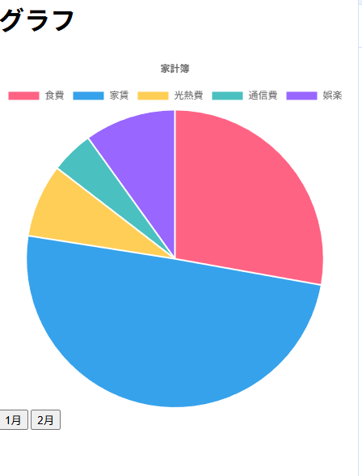

# typescriptでのグラフ表示練習
data.jsonはgeminiで生成しました  
## 起動方法
コマンドで  
docker compose up --build  

url  
http://localhost:5173  
## 実際の写真

## 学んだこと
npm install char.js  これでchart.jsを先にローカルに入れておくと最初の環境構築が楽  
ChartData の型を拝借するとめっちゃ楽に型を使える  
const chartData: ChartData<"pie">的な感じで一気にできる  
今まで、ローカルでマージしてgithubを使っていたが、pull request、pullの練習ができた  
git push origin --delete ブランチ名　　リモートブランチを消す(作業が終わったブランチは消す方がいい)  
viteでビルドするとpublicの中身はルート直下に移動するためpublicはつけない!!　　
## 工夫したところ
初めてのchart.jsだったが、グラフ描画関数をモジュールに分けてデータ、タイトルを受け取るように再利用性の高い関数にリファクタリングした  
各機能にファイルを分けて、責務分離を行えたと思う  
次はフォルダごとにもうちょっと整理してできたらいいなって思う  